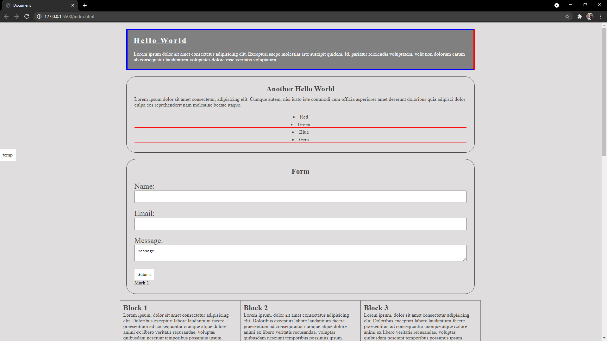
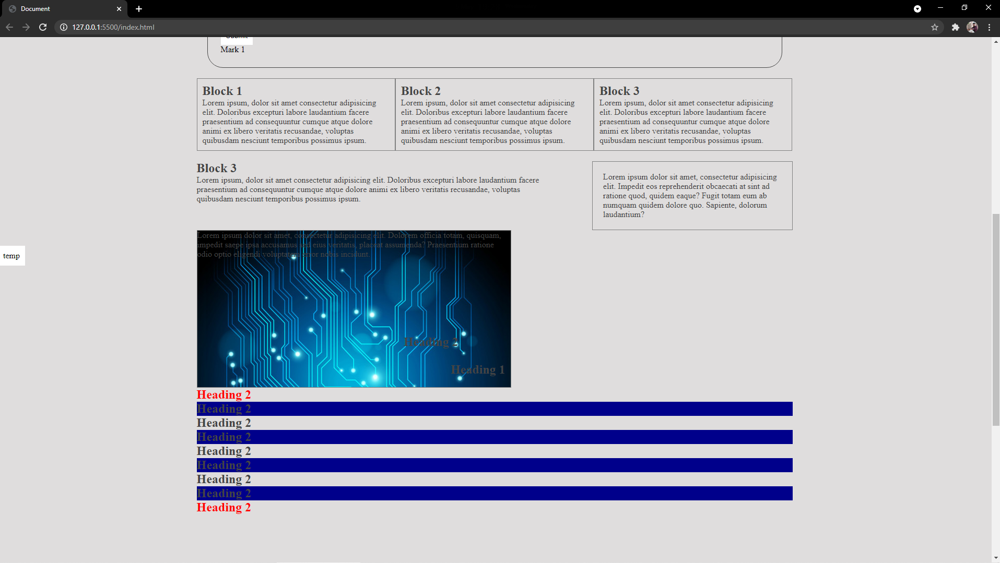
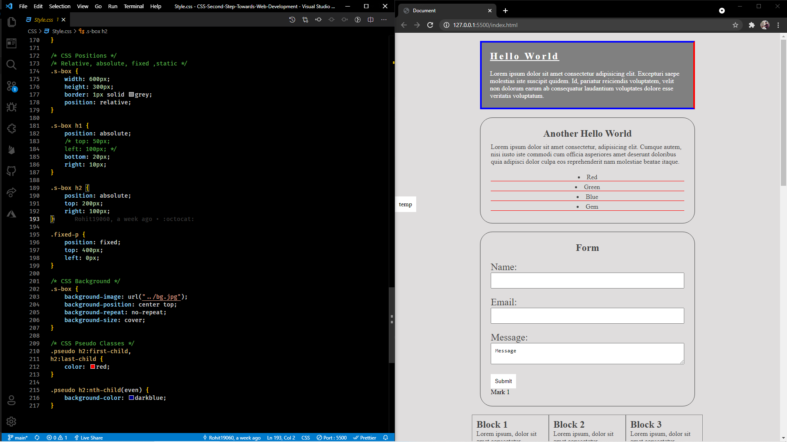

<h1 align="center">🌟CSS - Second Step Towards Web Development🌟</h1>

CSS Tutorial

## Links

- [YouTube Video](https://youtu.be/d1tP7ow7HbQ)
- [Github Repo](https://github.com/king-technologies/CSS-Second-Step-Towards-Web-Development)

## Screenshots

## Prerequisite

- Basic of Computer
- HTML

## Available Commands

- This is a tutorial-based Repo so there not anything that can be used in the projects but this is very educational.
- Just Run the index.html file or use live Server in VSCode

## Technologies Used

- HTML
- CSS

## Future Updates

- [x] As per Comments

## 🧑🏻 Author

**Rohit Jain**

- 🌌 [Profile](https://github.com/Rohit19060 "Rohit Jain")

- 🏮 [Email](mailto:rohitjain19060@gmail.com?subject=Hi "Hi!")

- 🦁 [Website](https://kingtechnologies.in "Welcome")

<h2 align="center">🤝 Support</h2>

🎀 Contributions (<a href="https://guides.github.com/introduction/flow" title="GitHub flow">GitHub flow</a>), 🔥 issues, and 🥮 feature requests are most welcome!

💙 If you like this project, Give it a ⭐ and Share it with friends!

💰 Donations Links

Made with CSS & ❤️ in India

